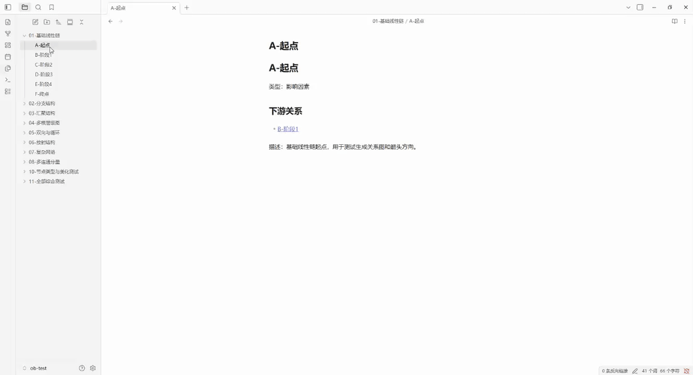
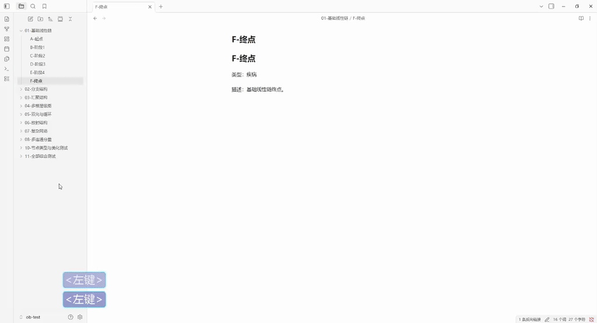
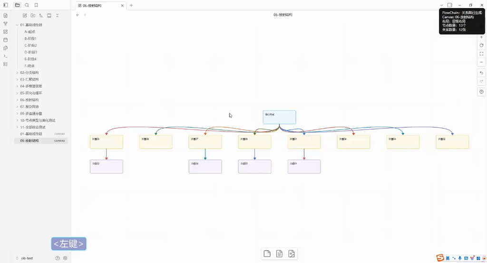

# FlowChain

English | [简体中文](docs/zh-cn/README.md)

FlowChain is an Obsidian plugin for generating, synchronizing, laying out, and styling knowledge relationship graphs from Markdown notes.

## Features

- Generate knowledge graphs from Markdown files.
- Refresh Canvas graphs from the original Markdown scope.
- Switch between multiple layout modes.
- Use smart layout recommendations.
- Beautify Canvas nodes and edges.
- Support directed and bidirectional relations.
- Support both English and Chinese Markdown relationship syntax.

## Demo

### Markdown format



### Generate graph



### Switch layout mode



## Markdown Format

Each Markdown file represents one graph node.

```md
# Node name

Type: Disease

## Downstream Relations

- [[Another node]]

## Bidirectional Relations

- [[Bidirectional node]]

Description:
Additional notes can span multiple lines.
```

Chinese syntax is also supported:

```md
# 节点名称

类型：疾病

## 下游关系

- [[下游节点]]

## 双向关系

- [[双向节点]]

描述：
可多行记录其它信息。
```

Rules:

- `Type:` or `类型：` defines the node type.
- `## Downstream Relations` or `## 下游关系` creates directed downstream edges.
- `## Bidirectional Relations` or `## 双向关系` creates bidirectional edges.
- Bidirectional relations may be declared in both files. FlowChain creates one shared bidirectional edge.
- `Description:` or `描述：` is only descriptive text and is not used to define relations.

See [Markdown Format](docs/Markdown%20Format.md) for the complete syntax reference.

## Commands

- FlowChain: 生成关系图
- FlowChain: 刷新同步关系图
- FlowChain: 选择布局模式
- FlowChain: 美化关系图

## Layouts

- 层级布局
- 层级布局-连线不穿过节点
- 树状布局
- 放射布局
- 力导向布局
- 环形布局
- 智能推荐布局

## Development

```bash
npm install
npm run build
npm run lint
```

The production build outputs `main.js` at the plugin root.

## Manual Installation

Download the latest release package from GitHub Releases.

For the current release, use:

```text
flowchain-0.1.2.zip
```

Do not use GitHub's auto-generated `Source code (zip)` for manual installation. The source archive is for developers and may not include the built `main.js` file that Obsidian needs to load the plugin.

Extract the release zip into:

```text
<Vault>/.obsidian/plugins/flowchain/
```

After extraction, the plugin folder should contain:

```text
<Vault>/.obsidian/plugins/flowchain/main.js
<Vault>/.obsidian/plugins/flowchain/manifest.json
<Vault>/.obsidian/plugins/flowchain/styles.css
```

Then reload Obsidian and enable FlowChain in **Settings -> Community plugins**.
